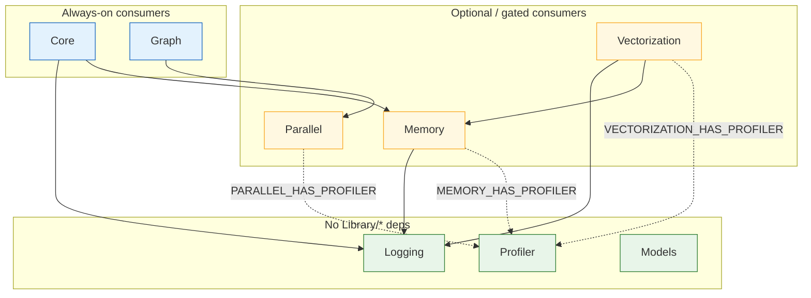
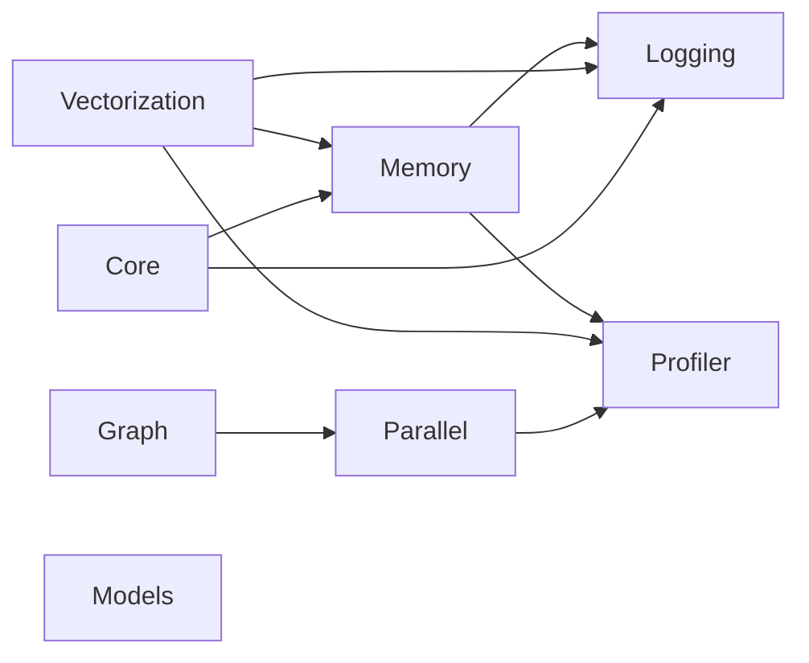
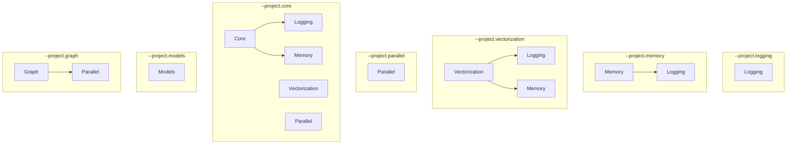
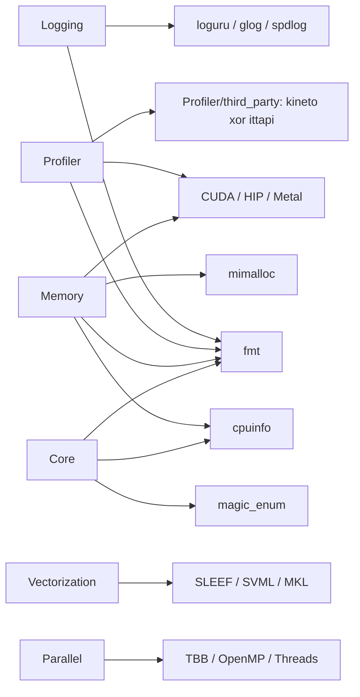

# Project dependencies

Inter-library links for XSigma (`Library/*`). Third-party packages are
summarized here and detailed in
[readme/third-party-dependencies.md](readme/third-party-dependencies.md).

CMake optional edges are `TARGET Xxx::Xxx` checks (or `MEMORY_ENABLE_*`).
Bazel hard-links the same edges. There is **no cycle**: Profiler must not
depend on Memory or Core. Logging is a **required** dependency of Memory,
Vectorization, and Core. Memory is a **required** dependency of Vectorization
and Core.

## Graphs

Arrows mean **links against** (A → B = A depends on B). Solid = always in a
full-tree build. Dashed = CMake-only optional (`HAS_*=0` if the target is
missing).

### Full tree (`Library/*`)

In a **full CMake configure** or **any Bazel build**, the dashed edges are
present (defaults ON / targets exist). `--project.memory` still builds Logging
(required). Profiler is a pure third-party dependency (`ThirdParty/Profiler`,
like cpuinfo/fmt): each consuming library adds it through
`xsigma_add_profiler()` in `ThirdParty/CMakeLists.txt`, so the Profiler edge
is present whenever a consumer is configured. There is no `--project.profiler`
— build the standalone Profiler repo for that.

`Models` has no `Library/*` link. `Graph` requires `Parallel::Parallel` and
inherits its Profiler dependency when enabled. Its current executor uses
Parallel's standard-thread callback queue. Financial Models integration is
future work; see the [Graph guide](graph/README.md).

### Bazel (unconditional)

Same nodes; every dashed edge above is a hard `deps` entry:

### CMake add_subdirectory order

`Library/*` modules are added in this order. Profiler is **not** in the list —
it is vendored third-party (`ThirdParty/Profiler`) and is configured on demand
by the first consuming library via `xsigma_add_profiler()` (idempotent), so
`TARGET Profiler::Profiler` succeeds in Memory / Vectorization / Parallel.

### `--project.NAME` scopes

What `XSIGMA_LIBRARY_PROJECT` actually `add_subdirectory`s (not the
link graph — only these modules exist in that configure):

Profiler (`ThirdParty/Profiler`) is configured additionally whenever Memory,
Vectorization, or Parallel is in scope — it comes from the third-party layer,
not from `XSIGMA_LIBRARY_PROJECT`.

### Third-party (typical)

Vendored trees live under `ThirdParty/` — do not edit them. See
[readme/third-party-dependencies.md](readme/third-party-dependencies.md).

## Libraries

| Library | Role | Depends on (`Library/*`) | Compile-time gates |
|---|---|---|---|
| **Logging** | Log backends (native / loguru / glog / spdlog) | none | — |
| **Profiler** | Native XPlane + Kineto/ITT (backend owned by Profiler) | none | `PROFILER_HAS_*` from Profiler; `PROFILER_HAS_METAL` / `CUDA` / `HIP` |
| **Memory** | Allocators, GPU pools | Logging, Profiler | `MEMORY_HAS_PROFILER` |
| **Vectorization** | SIMD / GPU packets | Logging, Memory, Profiler | `VECTORIZATION_HAS_PROFILER` |
| **Core** | Legacy computational core | Logging, Memory | (inherits Memory’s Profiler link when Memory has it) |
| **Parallel** | Thread pools / TBB / OpenMP | Profiler | `PARALLEL_HAS_PROFILER` |
| **Models** | SABR/ZABR + QA calibrator | none | — |
| **Graph** | Dependency DAG construction and execution | Parallel (required); Profiler through Parallel | inherits `PARALLEL_HAS_PROFILER` through Parallel |

### Memory gates

`MEMORY_HAS_PROFILER` is **computed**, not a cache option:

- Starts at **0**.
- Becomes **1** when `MEMORY_ENABLE_PROFILER` is ON (default **ON**) **and**
  `Profiler::Profiler` exists.
- Bazel always defines `MEMORY_HAS_PROFILER=1` (Memory always `deps` Profiler).

Logging is **required**: Memory always links `Logging::Logging`. There is no
`MEMORY_ENABLE_LOGGING` / `MEMORY_HAS_LOGGING` opt-out. `--project.memory`
configures Logging + Memory.

### Vectorization / Parallel gates

These are **not** user options. They follow whatever targets CMake has
already created:

| Macro | 1 when |
|---|---|
| `VECTORIZATION_HAS_PROFILER` | `Profiler::Profiler` exists |
| `PARALLEL_HAS_PROFILER` | `Profiler::Profiler` exists |

Logging and Memory are **required** for Vectorization (`FATAL_ERROR` if
`Logging::Logging` or `Memory::Memory` is missing). There is no
`VECTORIZATION_HAS_LOGGING` or `VECTORIZATION_HAS_MEMORY` gate.

## CMake configure order

Root `CMakeLists.txt` `_xsigma_lib_order`:

1. Logging
2. Profiler
3. Memory
4. Vectorization
5. Core
6. Parallel
7. Models
8. Graph

Profiler is early on purpose so `TARGET Profiler::Profiler` is true when
Memory, Vectorization, and Parallel run. Graph is configured after Parallel
because it requires the `Parallel::Parallel` target.

### `--project.NAME` / `XSIGMA_LIBRARY_PROJECT`

Only the listed modules are `add_subdirectory`’d (order above still
applies):

| `--project.` | Modules configured |
|---|---|
| `logging` | Logging |
| `memory` | Logging, Memory |
| `vectorization` | Logging, Memory, Vectorization |
| `parallel` | Parallel |
| `core` | Parallel, Logging, Memory, Vectorization, Core |
| `models` | Models |
| `graph` | Parallel, Graph |
| *(empty)* | all seven |

Profiler is not listed: it is pure third-party and is configured automatically
whenever Memory, Vectorization, or Parallel is in scope, so
`--project.memory` now also has `MEMORY_HAS_PROFILER=1` (when
`MEMORY_ENABLE_PROFILER` is ON) and always has Logging.

## Third-party (by library)

Always-vendored under `ThirdParty/` — do not edit those trees.

| Library | Typical third-party / system deps |
|---|---|
| Logging | fmt; one of loguru / spdlog / glog (`LOGGING_BACKEND`, default **LOGURU**) |
| Profiler | `ThirdParty/Profiler` only at XSigma root; kineto **or** ittapi live under `Profiler/third_party/` (private); CUDA / HIP / Metal+Foundation when that GPU backend is on |
| Memory | fmt, cpuinfo; optional mimalloc, tbbmalloc, numa, CUDA / HIP / Metal |
| Vectorization | Logging/Memory/Profiler as above; optional SLEEF, SVML, MKL, Accelerate, LibTorch (tests), CUDA / HIP / Metal |
| Core | fmt, cpuinfo; optional magic_enum, Enzyme, compression/snappy, MKL |
| Parallel | Threads; optional TBB, OpenMP |
| Models | none |
| Graph | Threads and transitive dependencies through Parallel; no additional direct third-party dependency |

Test binaries additionally link Google Test (and Google Benchmark when
enabled).

## Bazel notes

- Package graph matches the mermaid diagram. CMake optional edges (Profiler on
  Memory/Vectorization/Parallel) are unconditional `deps` in Bazel. Logging and
  Memory are required for Vectorization in both build systems.
- Profiler `BUILD.bazel` must **not** take `//Library/Core` or
  `//Library/Memory` — that would cycle with Memory → Profiler.
- Metal / CUDA / HIP are `select()`s on `--define=memory_enable_*` /
  `vectorization_enable_*` (see `.bazelrc` `build:metal` and
  `Scripts/setup_bazel.py --gpu_backend`).

## Related docs

- [PROJECT_FLAGS.md](PROJECT_FLAGS.md) — CMake cache flags
- [Graph guide](graph/README.md) — DAG execution, caching contracts and pricing integration status
- [readme/third-party-dependencies.md](readme/third-party-dependencies.md) — vendored packages
- [profiler/profiler.md](profiler/profiler.md) — Profiler instrumentation and `HAS_PROFILER` call sites
- [BAZEL_USER_GUIDE.md](BAZEL_USER_GUIDE.md) — Bazel configs and known gaps
