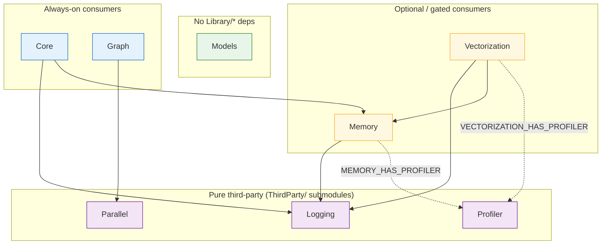
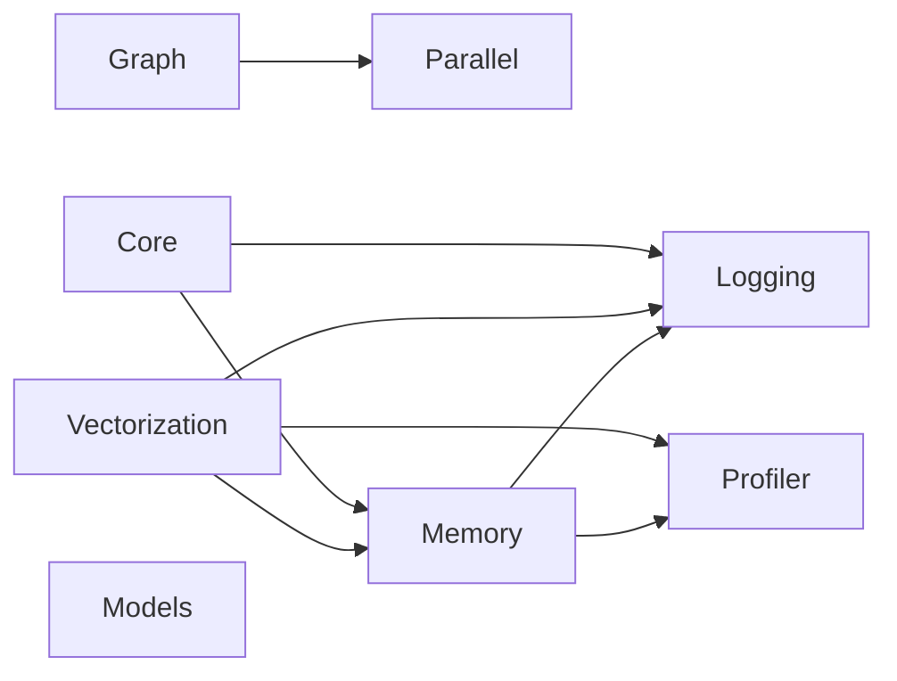
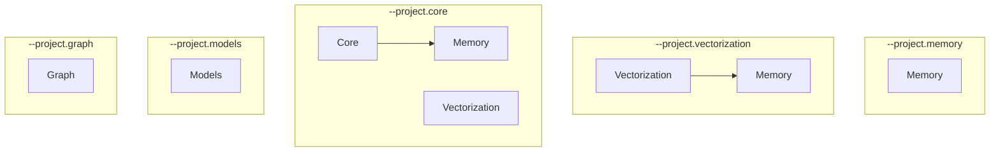
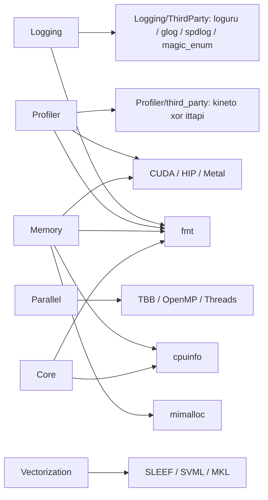

# Project dependencies

Inter-library links for XSigma (`Library/*`). Third-party packages are
summarized here and detailed in
[readme/third-party-dependencies.md](readme/third-party-dependencies.md).

CMake optional edges are `TARGET Xxx::Xxx` checks (or `MEMORY_ENABLE_*`).
Bazel hard-links the same edges. There is **no cycle**: Profiler must not
depend on Memory or Core. Logging (third-party) is a **required** dependency
of Memory, Vectorization, and Core; Parallel (third-party) is a **required**
dependency of Graph. Memory is a **required** dependency of Vectorization
and Core.

> **Logging and Parallel are pure third-party dependencies** — they live in
> their own repositories ([KhwarizmiAnalytix/Logging](https://github.com/KhwarizmiAnalytix/Logging),
> [KhwarizmiAnalytix/Parallel](https://github.com/KhwarizmiAnalytix/Parallel)),
> vendored as the `ThirdParty/Logging` and `ThirdParty/Parallel` submodules,
> exactly like `ThirdParty/Profiler`. XSigma feature flags do not fan into
> them; there are no `--project.logging` / `--project.parallel` scopes. Their
> tests and benchmarks run in the standalone repos, not in XSigma CI.

## Graphs

Arrows mean **links against** (A → B = A depends on B). Solid = always in a
full-tree build. Dashed = CMake-only optional (`HAS_*=0` if the target is
missing). Gray nodes are pure third-party (added on demand via
`xsigma_add_*()` in `ThirdParty/CMakeLists.txt`).

### Full tree (`Library/*` + on-demand third-party)

In a **full CMake configure** or **any Bazel build**, the dashed edges are
present (defaults ON / targets exist). Logging, Parallel, and Profiler are
pure third-party dependencies (`ThirdParty/Logging`, `ThirdParty/Parallel`,
`ThirdParty/Profiler`, like cpuinfo/fmt): each consuming library adds them
through `xsigma_add_logging()` / `xsigma_add_parallel()` /
`xsigma_add_profiler()` in `ThirdParty/CMakeLists.txt`, so the edges are
present whenever a consumer is configured. There are no `--project.logging`
/ `--project.parallel` / `--project.profiler` scopes — build the standalone
repos for that.

`Models` has no `Library/*` link. `Graph` requires `Parallel::Parallel`.
Its current executor uses Parallel's standard-thread callback queue.
Parallel has **no** Profiler dependency (`PARALLEL_HAS_PROFILER` was removed —
the thread pool no longer instruments `PROFILER_RECORD_USER_SCOPE`). Financial
Models integration is future work; see the [Graph guide](graph/README.md).

### Bazel (unconditional)

Same nodes; every dashed edge above is a hard `deps` entry on the external
repositories (`@logging`, `@parallel`, `@profiler`):

### CMake add_subdirectory order

`Library/*` modules are added in this order. Logging, Parallel, and Profiler
are **not** in the list — they are vendored third-party and are configured on
demand by the first consuming library via `xsigma_add_logging()` /
`xsigma_add_parallel()` / `xsigma_add_profiler()` (all idempotent), so
`TARGET Logging::Logging` / `Parallel::Parallel` / `Profiler::Profiler`
succeed in their consumers.

### `--project.NAME` scopes

What `XSIGMA_LIBRARY_PROJECT` actually `add_subdirectory`s (not the
link graph — only these modules exist in that configure):

Every scope additionally configures whichever third-party libraries its
modules consume: Logging (`ThirdParty/Logging`) whenever Memory /
Vectorization / Core is in scope, Parallel (`ThirdParty/Parallel`) whenever
Graph is in scope, Profiler whenever Memory or Vectorization is in scope.

### Third-party (typical)

Vendored trees live under `ThirdParty/` — do not edit them. See
[readme/third-party-dependencies.md](readme/third-party-dependencies.md).

## Libraries

| Library | Role | Depends on (`Library/*`) | Compile-time gates |
|---|---|---|---|
| **Memory** | Allocators, GPU pools | none (Logging + Profiler from third-party) | `MEMORY_HAS_PROFILER` |
| **Vectorization** | SIMD / GPU packets | Memory (Logging + Profiler from third-party) | `VECTORIZATION_HAS_PROFILER` |
| **Core** | Legacy computational core | Memory (Logging from third-party) | (inherits Memory’s Profiler link when Memory has it) |
| **Models** | SABR/ZABR + QA calibrator | none | — |
| **Graph** | Dependency DAG construction and execution | none (Parallel from third-party, required) | — |

### Memory gates

`MEMORY_HAS_PROFILER` is **computed**, not a cache option:

- Starts at **0**.
- Becomes **1** when `MEMORY_ENABLE_PROFILER` is ON (default **ON**) **and**
  `Profiler::Profiler` exists.
- Bazel always defines `MEMORY_HAS_PROFILER=1` (Memory always `deps` Profiler).

Logging is **required**: Memory always links `Logging::Logging`, added via
`xsigma_add_logging()`. There is no `MEMORY_ENABLE_LOGGING` /
`MEMORY_HAS_LOGGING` opt-out.

### Vectorization gate

This is **not** a user option. It follows whatever targets CMake has
already created:

| Macro | 1 when |
|---|---|
| `VECTORIZATION_HAS_PROFILER` | `Profiler::Profiler` exists |

Logging and Memory are **required** for Vectorization (`FATAL_ERROR` if
`Logging::Logging` or `Memory::Memory` is missing). There is no
`VECTORIZATION_HAS_LOGGING` or `VECTORIZATION_HAS_MEMORY` gate.

## CMake configure order

Root `CMakeLists.txt` `_xsigma_lib_order`:

1. Memory
2. Vectorization
3. Core
4. Models
5. Graph

Logging, Parallel, and Profiler are not in the order at all: consumers pull
them in on demand via `xsigma_add_logging()` / `xsigma_add_parallel()` /
`xsigma_add_profiler()` before referencing the targets, so
`TARGET Logging::Logging` / `Parallel::Parallel` / `Profiler::Profiler` are
true when the consumers run.

### `--project.NAME` / `XSIGMA_LIBRARY_PROJECT`

Only the listed modules are `add_subdirectory`’d (order above still
applies):

| `--project.` | Modules configured | Third-party pulled in on demand |
|---|---|---|
| `memory` | Memory | Logging, Profiler |
| `vectorization` | Memory, Vectorization | Logging, Profiler |
| `core` | Memory, Vectorization, Core | Logging, Profiler |
| `models` | Models | — |
| `graph` | Graph | Parallel |
| *(empty)* | all five | Logging, Parallel, Profiler |

## Third-party (by package)

Always-vendored under `ThirdParty/` — do not edit those trees.

| Package | Role | Used by |
|---|---|---|
| Logging | Log backends (native / loguru / glog / spdlog) and magic_enum under `Logging/ThirdParty/`; `LOGGING_BACKEND`, default **LOGURU** | Memory, Vectorization, Core |
| Parallel | Thread pools / TBB / OpenMP; `PARALLEL_BACKEND`, default **std** | Graph |
| Profiler | Native XPlane + Kineto/ITT; kineto **or** ittapi under `Profiler/third_party/` (private) | Memory, Vectorization |
| fmt | Formatting | Logging, Profiler, Memory, Core |
| cpuinfo | CPU feature detection | Memory, Core |
| Others | mimalloc, SLEEF, TBB, googletest, benchmark, … | per library |

Test binaries additionally link Google Test (and Google Benchmark when
enabled).

## Bazel notes

- Package graph matches the mermaid diagram, with Logging / Parallel /
  Profiler consumed as external repositories (`@logging//:Logging`,
  `@parallel//:Parallel`, `@profiler//:Profiler`) via overlay BUILD files
  (`ThirdParty/logging.BUILD`, `ThirdParty/parallel.BUILD`,
  `ThirdParty/profiler.BUILD`). CMake optional edges (Profiler on
  Memory/Vectorization) are unconditional `deps` in Bazel. Logging and
  Memory are required for Vectorization in both build systems.
- Profiler `BUILD.bazel` must **not** take `//Library/Core` or
  `//Library/Memory` — that would cycle with Memory → Profiler.
- Metal / CUDA / HIP are `select()`s on `--define=memory_enable_*` /
  `vectorization_enable_*` (see `.bazelrc` `build:metal` and
  `Scripts/setup_bazel.py --gpu_backend`).

## Related docs

- [PROJECT_FLAGS.md](PROJECT_FLAGS.md) — CMake cache flags
- [Graph guide](graph/README.md) — DAG execution, caching contracts and pricing integration status
- [readme/third-party-dependencies.md](readme/third-party-dependencies.md) — vendored packages
- [profiler/profiler.md](profiler/profiler.md) — Profiler instrumentation and `HAS_PROFILER` call sites
- [BAZEL_USER_GUIDE.md](BAZEL_USER_GUIDE.md) — Bazel configs and known gaps
