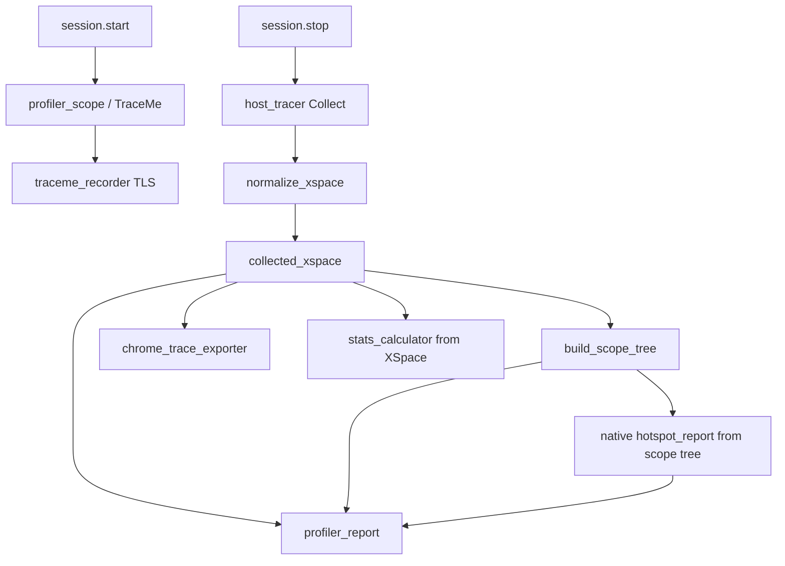
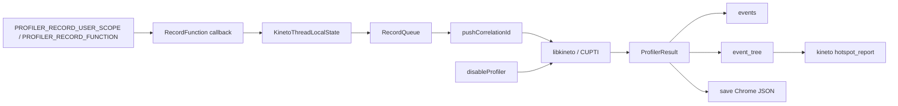
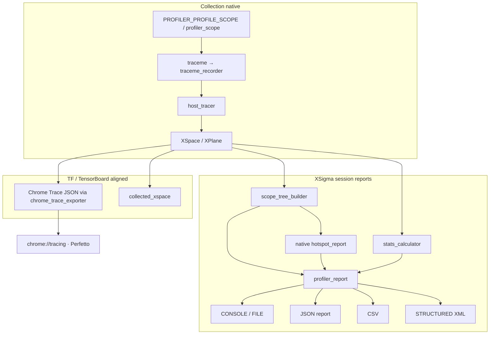

# XSigma Profiler

User guide, API, backends, examples, and architecture for
[`ThirdParty/Profiler`](../../ThirdParty/Profiler) (KhwarizmiAnalytix/Profiler).
Link `Profiler::Profiler` (CMake) or `@profiler//:Profiler` /
`//Library/Profiler:Profiler` (Bazel). Include `profiler.h`.

C++ only — there are no Python or C bindings in this repository.

## Table of contents

1. [Overview](#overview)
2. [Backends and build](#backends-and-build)
3. [Tests](#tests)
4. [Architecture](#architecture)
5. [Native end-to-end scheme](#native-end-to-end-scheme)
6. [Kineto end-to-end scheme](#kineto-end-to-end-scheme)
7. [Instrumentation](#instrumentation)
8. [Native session API](#native-session-api)
9. [Kineto](#kineto)
10. [ITT and NVTX](#itt-and-nvtx)
11. [GPU](#gpu)
12. [Runnable examples](#runnable-examples)
13. [Output formats](#output-formats)
14. [Hotspot report](#hotspot-report)
15. [Console table columns](#console-table-columns)
16. [Macros and feature flags](#macros-and-feature-flags)
17. [Dependencies](#dependencies)
18. [Best practices](#best-practices)
19. [Troubleshooting](#troubleshooting)
20. [Open follow-ups](#open-follow-ups)

---

## Overview

XSigma’s profiler is two pipelines that **compile together** and **do not share
a trace**:

| Pipeline | How you start it | What you get |
|---|---|---|
| Native (always on) | `profiler_session` + `PROFILER_PROFILE_SCOPE` / TraceMe | XSpace → Chrome Trace, session reports, `stats_calculator` node table, native `hotspot_report` |
| Instrumentation (one of Kineto **or** ITT) | `enableProfiler` + `PROFILER_RECORD_USER_SCOPE` / `PROFILER_RECORD_FUNCTION` | Kineto: `ProfilerResult` (events, event tree, `save()`, Kineto hotspot). ITT: VTune ranges, empty `ProfilerResult` |

NVTX is not a fourth backend — it is a `ProfilerState` inside the Kineto/ITT
orchestration layer.

| Capability | Notes |
|---|---|
| Timing | Native: `std::chrono` / TraceMe. Kineto: approximate clock → Unix via converter |
| Memory | Native `memory_tracker`; Kineto `profile_memory` + `report_memory_usage` / `report_out_of_memory` (CPU reporter + CUDA/HIP/Metal caching allocators); GPU `record_memory_history` / `memory_snapshot` |
| Hierarchy | Native: derived from XSpace interval nesting. Kineto: RecordFunction parent chain |
| Statistics | Native: `statistical_analyzer` (online samples) + `stats_calculator` (offline XSpace table) |
| Hotspots | Two types, same CPU self/total math — see [Hotspot report](#hotspot-report) |
| GPU | Native TensorFlow GpuTracer (`device_tracer_level` / `with_gpu_tracing()`) on `/device:GPU:N`; Kineto + CUPTI (or `KINETO_GPU_FALLBACK`) for CUDA — see [GPU](#gpu) |

| Backend | CMake | Macro | Sources | Third-party |
|---|---|---|---|---|
| Native / XPlane (always on) | n/a — not selectable | *(no gate)* | `native/` (+ `common/`) | none |
| Kineto (default instrumentation) | `PROFILER_BACKEND=KINETO` | `PROFILER_HAS_KINETO` | `bespoke/` | `ThirdParty/kineto` |
| ITT | `PROFILER_BACKEND=ITT` | `PROFILER_HAS_ITT` | `bespoke/` (minus Python/JIT-only) | `ThirdParty/ittapi` |
| NVTX | not independently selectable | n/a | `bespoke/base/nvtx_observer.cpp` | CUDA `nvToolsExt` (optional) |

Enabling both `PROFILER_HAS_KINETO` and `PROFILER_HAS_ITT` at once is a
configure-time error and a compile-time `#error` in
`common/profiler_export.h`. Native always compiles alongside whichever of
those two is selected.

---

## Backends and build

Use [`Scripts/setup.py`](../../Scripts/setup.py) for the recommended
whole-project workflow; direct CMake with `PROFILER_BACKEND=KINETO|ITT` is also
supported. The `--profiler.X` flag is a **separate argument**, not a dotted
token in the main chain (`profiler.itt` chained into `config.build.test…` does
not work).

### Native (always compiled)

`native/` plus shared `common/` are always compiled into `Profiler`.

- **Header:** `#include "native/session/profiler.h"`
- **Namespace:** `profiler` (`profiler_session_builder`, `profiler_session`,
  `profiler_scope`, `hotspot_report`). Scope macros: `PROFILER_PROFILE_SCOPE`,
  `PROFILER_PROFILE_FUNCTION`, `PROFILER_PROFILE_BLOCK`

`--profiler.native` is accepted as a no-op (with a warning) for older
invocations that selected a native-only backend. The native pipeline is already
compiled regardless of the Kineto or ITT instrumentation selection.

### Kineto (default)

Sets `PROFILER_HAS_KINETO=1`, links libkineto, compiles `bespoke/kineto`.

```bash
cd Scripts
python3 setup.py config.build.test.ninja.clang --project.profiler
```

- **CMake:** `-DPROFILER_BACKEND=KINETO` (default)
- **Bazel:** default, or `profiler_enable_kineto=true` with `profiler_type=kineto`

### ITT

```bash
cd Scripts
python3 setup.py config.build.test.ninja.clang --project.profiler --profiler.itt
```

- **CMake:** `-DPROFILER_BACKEND=ITT`
- **Bazel:** `--config=itt` (`profiler_type=itt` + `profiler_enable_itt=true`)

### GPU / CUPTI (Linux + CUDA Toolkit)

```bash
cd Scripts
python3 setup.py config.build.test.ninja --project.profiler --gpu_backend=cuda
```

Sets `MEMORY_GPU_BACKEND=cuda`, `LIBKINETO_NOCUPTI=OFF` when CUDA Toolkit is
found, and `PROFILER_HAS_CUDA=1`. Without that, CUPTI is compiled out
(`LIBKINETO_NOCUPTI=ON`) and GPU correlation cannot run.

### CMake options (library)

| Variable | Default | Values / notes |
|---|---|---|
| `PROFILER_BACKEND` | `KINETO` | `KINETO`, `ITT` — sets `PROFILER_ENABLE_KINETO`/`PROFILER_ENABLE_ITT`. `PROFILER_ENABLE_NATIVE_PROFILER` is always `ON`. |
| `PROFILER_ENABLE_TESTING` | ON | Tests |
| `PROFILER_ENABLE_EXAMPLES` | OFF | `Examples/Profiling` |
| `PROFILER_ENABLE_GTEST` | ON | GoogleTest |
| `PROFILER_ENABLE_BENCHMARK` | ON | Google Benchmark |
| `PROFILER_CXX_STANDARD` | 20 | 11–23 |

Root also exposes `PROFILER_INCLUDE_GATE_ONLY` to gate Kineto before
`add_subdirectory`.

### Bazel

Starlark: [`bazel/profiler.bzl`](../../bazel/profiler.bzl). `native/**` is
globbed in unconditionally in `BUILD.bazel`. Select order for the
instrumentation backend: **ITT** → default **Kineto**.

| Mode | Config | Result |
|---|---|---|
| Kineto (default) | *(none)* | `PROFILER_HAS_KINETO=1` |
| ITT | `--config=itt` | `PROFILER_HAS_ITT=1` |

LTO, coverage, sanitizers, linker/cache, spell, Valgrind are **CMake only**.

---

## Tests

`ProfilerCxxTests` always includes the native-pipeline tests. TUs that
include `bespoke/*` guard with `PROFILER_HAS_KINETO` or `PROFILER_HAS_ITT`.
CMake `TestFiles` and Bazel `_PROFILER_COMMON_TESTS` must stay in sync.

| File | What it covers |
|---|---|
| `TestProfilerBackendFunction.cpp` | Kineto / ITT / NVTX `PROFILER_RECORD_USER_SCOPE` nested CPU |
| `TestProfilerBackendMemory.cpp` | Same backends + `report_memory_usage` |
| `TestProfilerBackendOutput.cpp` | Native Chrome + console/JSON/CSV/XML; Node Stats from `stats_calculator` |
| `TestProfilerChromeTraceHierarchical.cpp` | Native Chrome Trace nesting / threads |
| `TestProfilerXPlanePipeline.cpp` | Session → `collected_xspace()` → visitor / sort / merge → report |
| `TestProfilerThreadpoolTracing.cpp` | `tracing::record_event` / `scoped_region` → Chrome + report |
| `TestProfilerNativeHotspot.cpp` | Native `generate_hotspot_report()` and console `=== Hotspots ===` |
| `TestProfilerGpuTracer.cpp` | Native TF GpuTracer `/device:GPU:N` (collector events + device probe) |
| `TestHotspotReport.cpp` | Kineto `hotspot_report` over `ProfilerResult::event_tree()` (`PROFILER_HAS_KINETO`) |
| `TestProfilerHeavyFunction.cpp` | Native + Kineto + ITT stress (matrix / Monte Carlo / FFT); PyTorch `torch::autograd::profiler` when `PROFILER_HAS_LIBTORCH` |

There is no `TestEnhancedProfiler.cpp`, `TestKinetoShim.cpp`, or
`TestRecordFunctionIntegration.cpp` — those names are obsolete.

---

## Architecture

```
Application
  PROFILER_RECORD_USER_SCOPE / PROFILER_PROFILE_SCOPE / TraceMe
        │
        ├─ Native session (always compiled)
        │     profiler_session → profiler_scope → traceme_recorder
        │     → host_tracer + gpu_tracer → XSpace
        │     → chrome_trace_exporter | scope_tree_builder
        │       | profiler_report | stats_calculator | native hotspot_report
        │
        └─ Bespoke orchestration (PROFILER_HAS_KINETO or PROFILER_HAS_ITT)
              RecordFunction callbacks
                    ├─ Kineto  (RecordQueue + libkineto → ProfilerResult)
                    ├─ ITT     (VTune ranges; empty ProfilerResult)
                    └─ NVTX    (Nsight ranges; empty ProfilerResult)
```

The two pipelines run side by side; they do **not** merge traces. Native
Chrome JSON is **not** the same file as `ProfilerResult::save()`.

`profiler_scope` emplaces a real `traceme` for its lifetime.
`build_scope_tree()` reconstructs nesting by interval containment after
`stop()`. `generate_chrome_trace_json()` / `write_chrome_trace()` use
`chrome_trace_exporter` on **native** `collected_xspace()` only.

### Native tree (`native/`)

| Directory | Role |
|---|---|
| `native/core/` | Plugin ABI: `profiler_interface`, `profiler_collection`, `profiler_factory`, `profiler_controller`, `profiler_lock` |
| `native/cpu/` | `host_tracer` over `traceme_recorder`, `annotation_stack`, stub Python tracer, `threadpool_listener` (`threadpool_profiler_interface` / `threadpool_event_collector`, fed via `tracing::record_event` / `scoped_region`) |
| `native/gpu/` | TensorFlow `GpuTracer` + `gpu_trace_collector` (`CreateGpuTracer` / `device_tracer_level`); Metal command-buffer times are the activity backend (CUPTI analog) |
| `native/tracing/` | `traceme` / recorder (independent of `PROFILER_RECORD_FUNCTION`) |
| `native/exporters/xplane/` | TensorBoard XPlane schema (ported; no TF runtime) |
| `native/exporters/` | `chrome_trace_exporter` (native XSpace → Chrome JSON) |
| `native/session/` | `profiler_session`, `profiler_scope`, `profiler_report`, `scope_tree_builder` |
| `native/analysis/` | `statistical_analyzer`, `stats_calculator`, native `hotspot_report` |
| `native/memory/` | Session-local alloc annotation (not `Library/Memory`) |

`host_tracer_factory.cpp` registers `host_tracer` at static-init.
`gpu_tracer_factory.cpp` registers `CreateGpuTracer` the same way (no-op when
`device_tracer_level == 0`).

### Bespoke tree (`bespoke/`)

Shared orchestration: `ProfilerConfig`, `ProfilerState` (`KINETO` / `ITT` /
`NVTX` / `KINETO_GPU_FALLBACK` / `KINETO_ONDEMAND`), `ActivityType`,
`MemoryReportingInfoBase`.

Kineto call chain:

1. `PROFILER_RECORD_USER_SCOPE` / `PROFILER_RECORD_FUNCTION` (`bespoke/common/record_function.h`)
2. `RecordFunctionCallback` registered by `enableProfiler`
3. Enter → `ThreadLocalSubqueue::begin_op` (push correlation id); exit stamps
   end time and pops the id
4. `KinetoThreadLocalState` holds a `RecordQueue`
5. `getRecords()` materializes `Result` objects and merges libkineto GPU/runtime
   activities by correlation id
6. Public view: `KinetoEvent` / `ProfilerResult`
7. Optional: Kineto `hotspot_report` over `event_tree()`; Chrome via `save()`

### Two instrumentation mechanisms (not unified)

| Mechanism | Pipeline | Header |
|---|---|---|
| `PROFILER_PROFILE_SCOPE` / TraceMe | Native | `native/session/profiler.h`, `native/tracing/traceme.h` |
| `PROFILER_RECORD_FUNCTION` / `PROFILER_RECORD_USER_SCOPE` | Kineto / ITT | `common/instrumentation.h` |

Unifying them as `profiler_interface` plugins is Phases 3–4 of the
[target architecture](#target-architecture).

### Target architecture

```
kernel / op / allocator / thread-pool code
        │
PROFILER_RECORD_FUNCTION / PROFILER_RECORD_USER_SCOPE     ← intended single call site
        │
RecordFunction callback dispatch
        ├─ Kineto tracer
        ├─ ITT tracer
        ├─ NVTX tracer
        └─ XPlane host tracer (not wired this way yet)
              each wrapped as profiler_interface
                    │
              profiler_collection (exists, unused as multiplexer)
                    │
              merged x_space          ← not implemented
                    ├─ chrome_trace
                    ├─ hotspot_report
                    └─ raw XSpace
```

Today: native already has its own XSpace + hotspot; Kineto has
`ProfilerResult` + a **separate** hotspot type. No merged XSpace.

| Phase | Intent | Status |
|---|---|---|
| 0 | Native always compiles; Kineto/ITT mutually exclusive with each other | Done |
| 1 | Drop dead tests / unused APIs | Done for tests listed in CMake/Bazel; `#if 0` Torch remnants remain in orchestration |
| 2 | Instrument real call sites via `common/instrumentation.h` | Vectorization, Parallel, Memory (CUDA/HIP/Metal caching allocators) done |
| 3 | Wrap each backend as `profiler_interface` | Not done |
| 4 | One user-facing session selecting activities | Not done |

---

## Native end-to-end scheme

All **native** exports share one collected **XSpace**. Hierarchy and hotspots
are derived after `stop()`.



| Step | API / component | What happens |
|---|---|---|
| 1 | `profiler_session::start()` | Lock, enable `traceme_recorder` / `host_tracer`, optional analyzer / memory tracker |
| 2 | Workload | `profiler_scope` / `PROFILER_PROFILE_SCOPE` emplace `traceme` |
| 3 | `stop()` | Collect XSpace, `normalize_xspace`, stop analyzer |
| 4 | Timeline | `generate_chrome_trace_json()` / `write_chrome_trace()` |
| 5 | Reports | `generate_report()` → console / JSON / CSV / XML |
| 6 | Node stats | `stats_calculator` via `CreateTfXPlaneVisitor` in the statistical section |
| 7 | Hierarchy | Lazy `build_scope_tree()` |
| 8 | Hotspots | `generate_hotspot_report()`; console/XML `=== Hotspots ===` |

```cpp
session.start();
{ PROFILER_PROFILE_SCOPE("work"); /* ... */ }
session.stop();

auto chrome = session.generate_chrome_trace_json();
auto report = session.generate_report();
std::cout << report->generate_console_report();

auto hotspots = session.generate_hotspot_report();
std::cout << hotspots->bottom_up_hotspots();
std::cout << hotspots->table();
```

---

## Kineto end-to-end scheme

Separate from native XSpace. Chrome for this path is `ProfilerResult::save()`,
not `chrome_trace_exporter`.



| Step | API | What happens |
|---|---|---|
| 1 | `prepareProfiler` / `enableProfiler` | libkineto prepare; register callbacks; start trace |
| 2 | Workload | `RECORD_*` RAII; corr id pushed for the scope lifetime |
| 3 | GPU (optional) | CUPTI / cudaEvent fallback stamps the same id on kernels launched **inside** the scope |
| 4 | `disableProfiler()` | Stop; merge CPU `Result`s with GPU activities |
| 5 | Consume | `events()`, `event_tree()`, `save(path)`, Kineto `hotspot_report` |

Do not wrap GPU launches in native `PROFILER_PROFILE_SCOPE` if you need
Kineto correlation — that path never calls `pushCorrelationId`.

---

## Instrumentation

Other libraries should include **`common/instrumentation.h`**, not
`bespoke/common/record_function.h` directly. Under Kineto/ITT the macros are
real. Current CMake always selects Kineto or ITT, so `PROFILER_RECORD_USER_SCOPE` is
not a no-op in production Profiler builds.

```cpp
#include "common/instrumentation.h"

void gemm(...) {
    PROFILER_RECORD_USER_SCOPE("vectorization::gemm");
    // GPU launch here is correlated when ActivityType::CUDA is enabled
}

profiler::report_memory_usage(
    ptr, /*alloc_size*/ static_cast<int64_t>(nbytes),
    total_allocated, total_reserved,
    /*device_type*/ static_cast<int16_t>(profiler::device_enum::cpu),
    /*device_index*/ -1);

profiler::report_out_of_memory(
    /*alloc_size*/ static_cast<int64_t>(nbytes),
    total_allocated, total_reserved,
    /*device_type*/ static_cast<int16_t>(profiler::device_enum::cpu),
    /*device_index*/ -1);
```

### Already instrumented

| Library | Site |
|---|---|
| Vectorization | Non-`noexcept` `tensor<T>` assign/construct overloads through `expressions_evaluator::run`. Scalar-fill `operator=(T2) noexcept` is **not** instrumented. |
| Parallel | `parallel::thread_pool::run_job` — execute boundary, not enqueue |
| Memory | CUDA/HIP (`cuda_caching_allocator`) and Metal (`metal_caching_allocator`) caching allocators — `allocate` / `deallocate` report the known post-rounding block size after `memory_profiling_active()` (predicted-false); OOM emits `[OutOfMemory]`. `record_memory_history` / `snapshot` dump segments and a bounded action ring (no stacks). CPU (`cpu::memory_allocator`) via `profiled_cpu_memory_reporter` when `MEMORY_HAS_PROFILER=1` — `[memory]` on alloc/free and `[OutOfMemory]` on malloc failure. `allocate_mi` / `allocate_tbb` are not wired. |

CMake/Bazel: `VECTORIZATION_HAS_PROFILER`, `PARALLEL_HAS_PROFILER`,
`MEMORY_ENABLE_PROFILER` / `MEMORY_HAS_PROFILER`. The CPU allocation path
does not keep always-on counters; see `Docs/memory_design.md` §3.

### RecordFunction macros (Kineto / ITT)

```cpp
PROFILER_RECORD_FUNCTION(fn)
PROFILER_RECORD_USER_SCOPE(fn)
PROFILER_RECORD_FUNCTION_WITH_SCOPE(scope, fn)
PROFILER_RECORD_FUNCTION_WITH_METADATA(guard_name, fn)
```

`PROFILER_RECORD_USER_SCOPE` expands to a local `profiler::RecordFunction` guard.
Destruct **before** `disableProfiler()`:

```cpp
enableProfilerInChildThread();
{
    PROFILER_RECORD_USER_SCOPE("worker");
    do_work();
}
disableProfilerInChildThread();
```

### Structured per-function metadata

`PROFILER_RECORD_FUNCTION`/`PROFILER_RECORD_USER_SCOPE` take only a name.
They are prefixed so they do not collide with LibTorch's `RECORD_FUNCTION` /
`RECORD_USER_SCOPE` in `ATen/record_function.h`.

To attach arbitrary
key-value data to a scope — profiling a non-tensor function's parameters,
not just its name — declare the guard with `PROFILER_RECORD_FUNCTION_WITH_METADATA`
(this does **not** start it) and immediately chain
`record_function_metadata_builder` to populate it and start it:

```cpp
PROFILER_RECORD_FUNCTION_WITH_METADATA(guard, "gemm");
profiler::record_function_metadata_builder(guard, "gemm")
    .with_metadata("m", m)
    .with_metadata("n", n)
    .with_metadata("k", k);
```

The builder starts `guard` (calls its `before()`, which runs the profiler's
start callbacks) in its own destructor, once the chained `with_metadata()`
calls finish — starting inside the macro instead would run those callbacks
before any metadata had been attached.

Values are stringified into the same map read back via
`KinetoEvent::extraMeta()`. This is XSigma's generic replacement for
PyTorch's IValue-based op-argument recording — no tensor/IValue type
involved, just `std::string`/`int64_t`/`double` key-value pairs.

Correlation stacks:

| Macro | libkineto call |
|---|---|
| `PROFILER_RECORD_FUNCTION` (default / op scopes) | `pushCorrelationId` / `popCorrelationId` |
| `PROFILER_RECORD_USER_SCOPE` | `pushUserCorrelationId` / `popUserCorrelationId` |

Leave `experimental_config.disable_external_correlation` false.

### `report_memory_usage`

Mirrors PyTorch `c10::reportMemoryUsageToProfiler`. No-op when no Kineto/ITT
session is active or `profile_memory` was not requested. Device type is
`profiler::device_enum`. Native session memory tracking is a separate
`memory_tracker` on `profiler_scope` stop.

---

## Native session API

Always available. Link `XSigma::Profiler`.

### Quick start

```cpp
#include "native/session/profiler.h"

using namespace profiler;

int main() {
    auto session = profiler_session_builder()
        .with_timing(true)
        .with_memory_tracking(true)
        .with_hierarchical_profiling(true)
        .with_statistical_analysis(true)
        .with_output_format(profiler_options::output_format_enum::JSON)
        .build();

    if (!session) {
        return 1;
    }
    session->start();

    {
        PROFILER_PROFILE_FUNCTION();
        {
            PROFILER_PROFILE_SCOPE("nested_operation");
            std::vector<int> data(1000, 42);
        }
    }

    session->stop();
    session->print_report();
    session->export_report("profile_results.json");
    session->write_chrome_trace("native_trace.json");
    return 0;
}
```

### Builder methods

| Method | Purpose |
|---|---|
| `with_timing(bool)` | Timing measurements |
| `with_memory_tracking(bool)` | Allocation tracking |
| `with_hierarchical_profiling(bool)` | Nested scopes (host tracer) |
| `with_statistical_analysis(bool)` | Online `statistical_analyzer` samples |
| `with_thread_safety(bool)` | Thread-safe collection |
| `with_gpu_tracing(bool)` | Maps to TF `device_tracer_level` (GpuTracer on `/device:GPU:N`) |
| `with_output_format(...)` | JSON, CSV, XML, console, FILE |
| `with_output_file(string)` | Default export path |
| `with_max_samples(size_t)` | Cap per series |
| `with_percentiles(bool)` | Percentile stats |
| `with_peak_memory_tracking(bool)` | Peak usage |
| `with_memory_deltas(bool)` | Deltas between points |
| `with_thread_pool_size(size_t)` | Worker-pool hint |
| `build()` | Returns `std::unique_ptr<profiler_session>` |

### Session methods

`start()` / `stop()` / `is_active()`, `create_scope(name)`,
`generate_report()` / `export_report(filename)` / `print_report()`,
`generate_hotspot_report()`, `collected_xspace()` /
`has_collected_xspace()`, `generate_chrome_trace_json()` /
`write_chrome_trace(path)`, `build_scope_tree()`.

### Scope macros

```cpp
PROFILER_PROFILE_SCOPE("scope_name");
PROFILER_PROFILE_FUNCTION();
PROFILER_PROFILE_BLOCK("block_name") {
    // ...
}
```

### TraceMe

```cpp
{
    traceme trace("traceme_scope");
    PROFILER_PROFILE_SCOPE("native_scope");
}
```

On mobile (`IS_MOBILE_PLATFORM`), `TraceMe` methods compile to no-ops.

### Memory tracker / statistical analyzer

Used internally by a session when those options are on. You can also
construct them standalone:

```cpp
memory_tracker tracker;
tracker.start_tracking();
void* ptr = malloc(1024);
tracker.track_allocation(ptr, 1024, "custom_allocation");
tracker.track_deallocation(ptr);
free(ptr);
auto mem = tracker.get_current_stats();
tracker.stop_tracking();

statistical_analyzer analyzer;
analyzer.start_analysis();
analyzer.add_timing_sample("my_function", duration_ms);
auto stats = analyzer.calculate_timing_stats("my_function");
analyzer.stop_analysis();
```

### Multi-threaded session

```cpp
auto session = profiler_session_builder()
    .with_thread_safety(true)
    .build();
session->start();

std::vector<std::thread> threads;
for (int i = 0; i < 4; ++i) {
    threads.emplace_back([i]() {
        PROFILER_PROFILE_SCOPE("thread_" + std::to_string(i));
    });
}
for (auto& t : threads) {
    t.join();
}
session->stop();
```

---

## Kineto

Default instrumentation backend. Public header:
`bespoke/kineto/profiler_kineto.h`. Namespace: `profiler::profiler_impl`
(public API; internals live in the nested `profiler::profiler_impl::impl`).
XSigma does **not** link libtorch.

### Enable / disable

```cpp
#include "bespoke/kineto/profiler_kineto.h"
#include "common/instrumentation.h"

using namespace profiler::profiler_impl;
using profiler::profiler_impl::impl::ActivityType;
using profiler::profiler_impl::impl::ProfilerConfig;
using profiler::profiler_impl::impl::ProfilerState;

ProfilerConfig config(ProfilerState::KINETO);
config.profile_memory = true;

std::set<ActivityType> activities{ActivityType::CPU};
enableProfiler(config, activities);
{
    PROFILER_RECORD_USER_SCOPE("matmul");
    // work
}
auto result = disableProfiler();
result->save("trace.json");

hotspot_report hot(*result);
std::cout << hot.table();
```

| Function | Role |
|---|---|
| `prepareProfiler(config, activities)` | Prepare libkineto before start |
| `enableProfiler(config, activities, scopes = {})` | Push TLS state, register callbacks, start trace |
| `enableProfilerWithEventPostProcess(..., cb, scopes)` | Same, plus lazy event enrichment |
| `disableProfiler()` | Stop, materialize `KinetoEvent`s, return `ProfilerResult` |
| `toggleCollectionDynamic(enable, activities)` | Pause/resume collection |
| `enableProfilerInChildThread()` / `disableProfilerInChildThread()` | Opt a worker into the main session |
| `isProfilerEnabledInMainThread()` | Query |
| `startMemoryProfile()` / `stopMemoryProfile()` / `exportMemoryProfile(path)` | Memory-profile export |
| `reportBackendEventToActiveKinetoProfiler(...)` | Inject a backend span |

Child threads do **not** participate unless they call
`enableProfilerInChildThread()`.

CPU tests cover prepare/enable/disable, nested `PROFILER_RECORD_USER_SCOPE`,
`events()`, `event_tree()`, `save()`, and Kineto hotspots. The APIs in the
table after `disableProfiler()` (toggle, child thread, memory profile,
backend events, post-process) are compiled but not exercised by
`ProfilerCxxTests`.

### Config

```cpp
struct ProfilerConfig {
    ProfilerState state;       // KINETO, KINETO_GPU_FALLBACK, KINETO_ONDEMAND, NVTX, ITT
    bool report_input_shapes;
    bool profile_memory;
    bool with_stack;           // source file:line call sites for RecordFunction events
    bool with_flops;
    bool with_modules;
    ExperimentalConfig experimental_config;
    std::string trace_id;
};
```

`ActivityType`: `CPU`, `CUDA`, `HIP`, `Metal` (`PrivateUse1` is an alias for
`Metal`). Intel XPU, Habana HPU, and Meta MTIA are not XSigma backends and
are not exposed. HIP uses the same libkineto GPU activity set as CUDA
(roctracer reuses those type names).

`RecordScope`: `FUNCTION`, `BACKWARD_FUNCTION`, `CUSTOM_CLASS`, `USER_SCOPE`,
`STATIC_RUNTIME_OP`, `STATIC_RUNTIME_MODEL`.

### Results

```cpp
struct ProfilerResult {
    uint64_t trace_start_ns() const;
    const std::vector<KinetoEvent>& events() const;
    const std::vector<experimental_event_t>& event_tree() const;
    bool save(const std::string& path);  // Chrome Trace JSON; false if there is no trace
};
```

`KinetoEvent` exposes name, start/end/duration ns, device type/index,
`correlationId()` / `linkedCorrelationId()`, optional shapes/stack/module
hierarchy, FLOPs, extra metadata, `cudaElapsedUs()` when CUDA events exist.

### Clock conversion and correlation IDs

Events are stamped with an approximate clock and converted to Unix time via
`ApproximateClockToUnixTimeConverter`. GPU kernels are linked to the
launching CPU op by correlation id (`kineto_shim`: `pushCorrelationId` /
`pushUserCorrelationId`). You do not call those helpers from application
code — `RECORD_*` does.

### libkineto surface

XSigma never includes `libkineto.h` from a public header. TUs that talk to
it: `bespoke/kineto/kineto_shim.cpp`, `kineto_client_interface.cpp`
(on-demand).

Activity types XSigma maps but does not generate itself (CUPTI / libkineto
must produce them): `GPU_MEMCPY`, `GPU_MEMSET`, `CONCURRENT_KERNEL`,
`CUDA_RUNTIME`, `CUDA_DRIVER`, `CUDA_SYNC`, `PYTHON_FUNCTION`,
`PRIVATEUSE1_*`, `COLLECTIVE_COMM`, `OVERHEAD`.

### PyTorch types removed (tensor-independence pass)

Not a PyTorch runtime, and not tensor-op-specific. Deleted (confirmed dead —
never populated by any call site, never asserted by any test): `TensorMetadata`
/ `RawTensorMetadata` / `StorageImplData` / `op_input_t`, `IValue` tensor
branches, `FunctionSchema` / `OperatorHandle`, Vulkan events, NCCL helpers,
`ProfilerConfig::{to,from}IValue`, TorchScript/lite `RecordScope`s,
`computeFlops` (was a stub returning 0), the JIT-debug-handle post-processing
callback (`post_process_t` / `enableProfilerWithEventPostProcess`), and the
`jit_stack_` / `jit_modules_` / `extra_args_` / `kwinputs_` / `allow_tf32_cublas_`
fields that only existed to feed those.

Renamed for accuracy: `EventType::TorchOp` → `EventType::FunctionOp` (a
generic `PROFILER_RECORD_FUNCTION` CPU span — it now holds nothing tensor-specific),
`profiler::autograd::profiler_impl` → `profiler::profiler_impl` (dropped
`autograd::`; there is no autograd engine in this repo).

Kept: Python tracer plug-in (default no-op), `PRIVATEUSE1` observer.

**Generic per-function metadata**: `RecordFunction::addMetadata(key, value)` /
`record_function_metadata_builder` / `PROFILER_RECORD_FUNCTION_WITH_METADATA` attach
arbitrary string/numeric key-value pairs to any instrumented scope, surfaced
via `KinetoEvent::extraMeta()` — this is the mechanism for profiling
non-tensor functions with structured data, replacing the deleted
tensor-shaped `extra_args_`/`kwinputs_`.

### Python tracer plug-in

`bespoke/common/orchestration/python_tracer.{h,cpp}`: `PythonTracerBase` /
`registerTracer`. Native `python_tracer_factory.cpp` registers a stub
`profiler_interface` when `python_tracer_level > 0`. Full CPython
`PyEval_SetProfile` bindings were removed.

### Thread safety

Per-thread `RecordQueue` subqueues: recording is unsynchronized.
Synchronized: `ProfilerStateBase::push` / `pop`, callback registration.
See [known `handle_` bug](#open-follow-ups).

---

## ITT and NVTX

### ITT (VTune)

Vendored `ThirdParty/ittapi`. Shares `bespoke/base/` and `bespoke/common/`
with Kineto. When ITT is built **without** Kineto, CMake hand-enumerates
`profiler_kineto.{h,cpp}`, `kineto_shim.cpp`,
`kineto_client_interface.{h,cpp}` and sets `FMT_HEADER_ONLY=1`.

```cpp
#include "bespoke/itt/itt_wrapper.h"

profiler::profiler_impl::itt_init();
if (profiler::profiler_impl::itt_get_domain() != nullptr) {
    profiler::profiler_impl::itt_range_push("my_operation");
    // work
    profiler::profiler_impl::itt_range_pop();
    profiler::profiler_impl::itt_mark("checkpoint");
}
```

Same `enableProfiler` / `disableProfiler` entry point, `ProfilerState::ITT`.
ITT does **not** use `RecordQueue` / `KinetoEvent`; `disableProfiler()`
returns an empty `ProfilerResult`. Ranges go to VTune.

```bash
vtune -collect hotspots -app ./bin/example_profiling_basic
vtune-gui
```

Native session still works under an ITT build (always-on pipeline). Use that
for Chrome JSON; use ITT ranges for VTune.

### NVTX (Nsight)

`ProfilerState::NVTX`, available whenever Kineto or ITT compiled
`bespoke/base/`. `pushNVTXCallbacks` → `enterNVTX` →
`cudaStubs()->rangePush` when `PROFILER_HAS_CUDA`. Tensor
producer/consumer correlation is a no-op.

---

## GPU

Two independent GPU paths. They do **not** share a trace.

### Native GpuTracer (TensorFlow device tracer)

Port of TF/XLA `GpuTracer` (`device_tracer_cuda.cc`) + `CuptiTraceCollector`.
`CreateGpuTracer` is a `profiler_factory` gated by `device_tracer_level()`
(session: `with_gpu_tracing()`). Events land on XPlane `/device:GPU:<ordinal>`
with `kStream` / `kKernelDetails` / `kCorrelationId`, then `AddFlowsToXplane`.

Activity backends fill the collector the same way CUPTI callbacks do in TF:

- **Metal** (`PROFILER_HAS_METAL`) — command-buffer `GPUStartTime`/`GPUEndTime`
- **CUDA CUPTI** — not in this native plugin (use the Kineto path below)

```cpp
#include "native/session/profiler.h"
#include "native/gpu/gpu_tracer.h"

auto session = profiler_session_builder()
    .with_timing(true)
    .with_gpu_tracing()
    .build();
session->start();
{
    PROFILER_PROFILE_SCOPE("host_launch");
    // Device backends call profiler_impl::add_gpu_tracer_event()
    // (CuptiTraceCollector::AddEvent). Vectorization Metal dispatches do this
    // after waitUntilCompleted.
}
session->stop();
session->write_chrome_trace("native_gpu.json");  // process "/device:GPU:0"
```

`profiler_scope` pushes TF `annotation_stack` while GpuTracer is recording so
kernel events can pick up `kCorrelationId` from the host scope.

### CUDA / CUPTI (Kineto)

Profiler **Kineto activity tracing** is CUDA-only. No HIP activity backend
under `Library/Profiler`. Memory **allocators** call `report_memory_usage`
directly (CUDA, HIP, and Metal caching allocators are all wired), independent
of Kineto activity tracing.

Two CUDA paths, both gated by `PROFILER_HAS_CUDA` (`MEMORY_GPU_BACKEND=cuda`
and `find_package(CUDAToolkit)`):

1. **CUPTI** — kernel / memcpy / memset on device, correlated to the
   launching CPU `RECORD_*`. Needs `LIBKINETO_NOCUPTI=OFF`.
2. **`KINETO_GPU_FALLBACK`** — `cudaEvent_t` pair in `bespoke/base/cuda.cpp`
   on the default per-thread stream (no stream pool).

`PROFILER_HAS_CUDA=0` is the verified path on this macOS host. CUPTI needs a
CUDA Toolkit machine.

### How to profile GPU with RecordFunction correlation

You do **not** call `pushCorrelationId` yourself.

```cpp
ProfilerConfig config(ProfilerState::KINETO);
std::set<ActivityType> activities{ActivityType::CPU, ActivityType::CUDA};

prepareProfiler(config, activities);
enableProfiler(config, activities);

{
    PROFILER_RECORD_FUNCTION("gemm_launch");  // or PROFILER_RECORD_USER_SCOPE
    // cudaLaunchKernel / GPU tensor eval / memcpy MUST happen here
    cudaDeviceSynchronize();
}

auto result = disableProfiler();
result->save("kineto_gpu.json");

for (const auto& e : result->events()) {
    (void)e.correlationId();
    (void)e.linkedCorrelationId();
    (void)e.cudaElapsedUs();
}

hotspot_report hot(*result);
std::cout << hot.table();  // CUDA columns when self_cuda_ns > 0
```

Rules:

- Enable **CPU and CUDA**. GPU-only traces often have broken links.
- Keep the kernel **inside** the RAII scope.
- Workers need `enableProfilerInChildThread()`.
- Without CUPTI: `ProfilerState::KINETO_GPU_FALLBACK` (still needs
  `PROFILER_HAS_CUDA=1`).
- Native TraceMe scopes do not participate.

---

## Runnable examples

Sources: [`Examples/Profiling/`](../../Examples/Profiling/)
(`example_profiling_basic.cpp`).

```bash
cd Scripts
python3 setup.py config.build.examples.ninja.clang
```

Binary: `build_ninja/bin/example_profiling_basic`. Typical traces:

| File | Pipeline |
|---|---|
| `xsigma_native_profile.json` | Native Chrome Trace (`write_chrome_trace`) |
| `kineto_xsigma_trace.json` / `kineto_only_trace.json` | Kineto `ProfilerResult::save()` |
| `itt_xsigma_trace.json` | Native Chrome from the ITT example (ITT ranges are VTune-only) |

### Visualize Chrome Trace

- **chrome://tracing** — Load the JSON; W/S zoom, A/D pan.
- **[Perfetto UI](https://ui.perfetto.dev)**

Native Chrome JSON uses nanoseconds and `"displayTimeUnit": "ns"`.
Kineto `save()` is libkineto’s Chrome format (may differ in time unit).

---

## Output formats

### Native profiler outputs

After `profiler_session::stop()`, collection lives in an in-memory **XSpace**.
Native exports are derived from that (plus analyzer/memory samples):



| Path | API | Compatible with |
|------|-----|-----------------|
| Native Chrome Trace | `generate_chrome_trace_json()` / `write_chrome_trace(path)` | Chrome Trace Event Format |
| XPlane / XSpace | `collected_xspace()` | TensorBoard plane model (in memory) |
| Native hotspots | `generate_hotspot_report()` / console `=== Hotspots ===` | CPU bottom-up / `key_averages`-style table, no CUDA/XPU |
| Console / FILE | `print_report()` / `export_report()` | XSigma text |
| JSON report | `generate_json_report()` | XSigma — **not** `traceEvents` |
| CSV | `generate_csv_report()` | XSigma |
| STRUCTURED | `generate_xml_report()` | XSigma XML |
| Kineto Chrome | `ProfilerResult::save(path)` | libkineto Chrome JSON |
| Kineto hotspots | `profiler_impl::hotspot_report` | CPU + optional CUDA/XPU columns |

Native Chrome is **not** selected via `output_format_`. `FILE` and `CONSOLE`
share the same text formatter; `STRUCTURED` means XML.

Tests: `TestProfilerBackendOutput.cpp`, `TestProfilerNativeHotspot.cpp`,
`TestHotspotReport.cpp`.

### JSON (native session report)

```json
{
  "header": {
    "active": false,
    "scope_count": 2
  },
  "scopes": [],
  "top_durations": [],
  "memory": {}
}
```

(Exact keys from `profiler_report::generate_json_report()`.)

### CSV

Header: `Scope,Depth,Thread,Duration(ms),Memory Delta Mean,Memory Delta Max`.

### Native Chrome Trace

```json
{
  "traceEvents": [
    {"name": "process_name", "ph": "M", "pid": 1, "args": {"name": "Host"}},
    {"name": "main_scope", "ph": "X", "pid": 1, "tid": 100, "ts": 1000, "dur": 1000000}
  ],
  "displayTimeUnit": "ns"
}
```

### XPlane

Planes / lines / events in `native/exporters/xplane/`. Same model TensorBoard’s
profiler plugin consumes. No on-disk XPlane writer yet.

### Console

Header, summary, hierarchy, timing, memory, statistical analysis (analyzer +
`stats_calculator` Node Stats), **Hotspots**, threads.

---

## Hotspot report

Two implementations share CPU self/total math. They do **not** share types.

| | Native | Kineto |
|---|---|---|
| Header | `native/analysis/hotspot_report.h` → `profiler::hotspot_report` | `bespoke/kineto/hotspot_report.h` → `profiler::profiler_impl::hotspot_report` |
| Input | `build_scope_tree()` | `ProfilerResult::event_tree()` |
| GPU columns | No | CUDA / XPU when those times are non-zero |
| API | `generate_hotspot_report()`; console/XML `=== Hotspots ===` | After `disableProfiler()` |
| Build gate | Always | `PROFILER_HAS_KINETO` |
| Tests | `TestProfilerNativeHotspot.cpp` | `TestHotspotReport.cpp` |

Semantics: `total = end − start`, `self = total − sum(children totals)`,
merge by name, sort by self descending.

### Native

```cpp
session.stop();
auto report = session.generate_hotspot_report();
std::cout << report->top_down_tree();
std::cout << report->bottom_up_hotspots();
std::cout << report->call_stack_for("nested_operation");
std::cout << report->table();
```

Synthetic `"ROOT"` is walked but not emitted as a row.

### Kineto

Instrumentation-based (not PC sampling). Call stack in hotspot reports is the
RecordFunction parent chain. `config.with_stack` records the source `file:line`
for `PROFILER_RECORD_FUNCTION` / `PROFILER_RECORD_USER_SCOPE` events.

```cpp
auto result = profiler::profiler_impl::disableProfiler();
profiler::profiler_impl::hotspot_report report(*result);

std::cout << report.top_down_tree();
std::cout << report.bottom_up_hotspots();
std::cout << report.table();
std::cout << report.table("self_cuda_time_total", /*row_limit=*/10);
```

```
== Bottom-up hotspots ==
self time      total time     calls  name
3.00ms         3.00ms         1      gemm_kernel
1.00ms         5.00ms         1      matmul
```

---

## Console table columns

`hotspot_report::table(sort_by, row_limit)` matches PyTorch
`key_averages().table()` CPU columns. Native omits CUDA/XPU columns.
Kineto adds them when device self-time is non-zero.

| Column | Formula | Format |
|---|---|---|
| Name | Aggregated scope / op / kernel name | Left, min width 20 |
| Self CPU % | `(self_cpu / sum(self_cpu)) * 100` | `XX.XX%`, width 12 |
| Self CPU | CPU time excluding same-device children | us/ms/s, 3 decimals |
| CPU total % | `(cpu_total / sum(self_cpu)) * 100` | `XX.XX%` |
| CPU total | Inclusive CPU time | us/ms/s |
| CPU time avg | `cpu_total / call_count` | us/ms/s |
| Self CUDA / % / total / avg | Kineto only; omitted when all zeros | Optional |
| Self XPU / % / total / avg | Kineto only; omitted when all zeros | Optional |
| # of Calls | Aggregated invocation count | Integer |

Footer: `Self CPU time total:` (and CUDA/XPU totals when shown).
`sort_by`: `self_cpu_time_total`, `cpu_time_total`, `cpu_time_avg`,
`self_cuda_time_total`, `self_xpu_time_total`, `count`, and matching
`*_total` / `*_avg`. Empty `sort_by` keeps self-CPU descending. `row_limit`
0 prints every row.

---

## Macros and feature flags

### User-facing

| Macro | Header | Role |
|---|---|---|
| `PROFILER_PROFILE_SCOPE` / `_FUNCTION` / `_BLOCK` | `native/session/profiler.h` | Native RAII scopes |
| `PROFILER_RECORD_FUNCTION` / `PROFILER_RECORD_USER_SCOPE` / … | `common/instrumentation.h` | Kineto/ITT scopes |
| `PROFILER_API` / `PROFILER_VISIBILITY` / `PROFILER_UNUSED` | `common/profiler_export.h`, `common/profiler_macros.h` | Export / unused params |
| `PROFILER_LIKELY` / `PROFILER_UNLIKELY` / `PROFILER_NODISCARD` | `common/profiler_macros.h` | Attributes |

### Backend flags

`PROFILER_HAS_KINETO` and `PROFILER_HAS_ITT` are mutually exclusive.
Native has no `HAS_*` gate.

| Macro | Purpose |
|---|---|
| `PROFILER_HAS_KINETO` | Kineto GPU/CPU activity tracing |
| `PROFILER_HAS_ITT` | Intel VTune ITT ranges |
| `PROFILER_HAS_CUDA` | CUDA Runtime + optional CUPTI/NVTX |
| `PROFILER_HAS_METAL` | Metal activity backend for native GpuTracer (`GPUStartTime`) |
| `PROFILER_HAS_INSTRUMENTATION` | 1 when Kineto or ITT (`instrumentation.h`) |
| `XSIGMA_HAS_CUDA` | CUDA event types / NVML inside the Kineto wrapper |
| `KINETO_HAS_HCCL_PROFILER` | AMD HCCL hooks (ROCm + HCCL only) |

CMake injects `PROFILER_ENABLE_KINETO` or `PROFILER_ENABLE_ITT`, and
`PROFILER_ENABLE_NATIVE_PROFILER` (always `ON`). Tests define
`PROFILER_GOOGLE_TEST`.

### Other compile-time switches

| Macro | Purpose |
|---|---|
| `PROFILER_MOBILE` / `PROFILER_IOS` | Reduced features; iOS clock path |
| `PROFILER_USE_ROCM` | ROCm HIP activity collection |
| `PROFILER_CUDA_USE_NVTX3` | NVTX3 header-only API |
| `PROFILER_PREFER_CUSTOM_THREAD_LOCAL_STORAGE` | Custom TLS on hot paths |
| `PROFILER_RDTSC` | x86 cycle-counter clock |
| `ENABLE_GLOBAL_OBSERVER` | System-wide activity observer |
| `USE_DISTRIBUTED` | NCCL rank / collective metadata |
| `EDGE_PROFILER_USE_KINETO` | Embedded Kineto client path |

`#if 0` in orchestration (`collection.cpp`, Python/Torch remnants) is
intentional. Do not re-enable without the missing types.

---

## Dependencies

| Backend | Links |
|---|---|
| Kineto | `Kineto::kineto` (`ThirdParty/kineto`), fmt (via libkineto), optional `CUDA::cudart` + `CUDA::nvToolsExt` |
| ITT | vendored ittapi; fmt header-only on this branch; borrowed Kineto orchestration TUs |
| Native | C++ standard library only |

Profiler does not depend on `Library/Core`. Consuming libraries (Memory,
Vectorization, Parallel) may depend on Profiler.

No pybind11 / `extern "C"` public ABI.

---

## Best practices

1. **RAII scopes** — `PROFILER_PROFILE_SCOPE` or `PROFILER_RECORD_USER_SCOPE` in `{ }`;
   never disable the session before the guard destructs.
2. **Pick one pipeline for a given question.** Native for CPU Chrome/hotspots
   without Kineto. Kineto `RECORD_*` for GPU correlation and
   `ProfilerResult::save()`.
3. **Instrument boundaries**, not inner loops.
4. **Short names** on the hot path.
5. **Enable only what you need** — timing vs memory vs stats vs CUDA.
6. **GPU** — Native: `with_gpu_tracing()` (TF GpuTracer). Kineto CUDA: `ActivityType::CPU` **and** `CUDA`; launch inside `RECORD_*`.
7. **Threads** — Native: `.with_thread_safety(true)`. Kineto:
   `enableProfilerInChildThread()`.
8. **Do not instrument `noexcept` functions** with `PROFILER_RECORD_USER_SCOPE`.

---

## Troubleshooting

| Symptom | What to check |
|---|---|
| Empty `ProfilerResult` / no CPU events | `PROFILER_RECORD_USER_SCOPE` must destruct before `disableProfiler()`. |
| Child thread missing from the Kineto trace | `enableProfilerInChildThread()` on that thread. |
| GPU kernels uncorrelated / missing | CUDA: `ActivityType::CUDA` + `CPU`; CUPTI on (`LIBKINETO_NOCUPTI=OFF`); launch inside `RECORD_*`; not native TraceMe. Native GpuTracer: `with_gpu_tracing()`; activity backend recording while the session is active. |
| High overhead | Fewer / coarser scopes; disable memory/stats/CUDA; avoid per-iteration names. |
| Empty or tiny JSON | Native: `start`/`stop` then `write_chrome_trace`. Kineto: `save()` after `disableProfiler()`. |
| Kineto trace has no events | `ActivityType::CPU` only sees `RecordFunction`. Wrap ad-hoc CPU in `PROFILER_RECORD_USER_SCOPE`. |
| ITT ranges missing in VTune | Run under VTune; `itt_get_domain()` non-null; `PROFILER_HAS_ITT=1`. |
| Chrome “Invalid trace format” | `stop()` / `disableProfiler()` before export; `python3 -m json.tool`. |
| Native header missing | Native is always compiled. Include `native/session/profiler.h`. |
| ITT-only link errors on fmt | ITT-without-Kineto uses `FMT_HEADER_ONLY=1` (CMake already sets this). |
| Missing shapes / stacks | `report_input_shapes` / `with_stack`; tensor shapes stay empty without a tensor type. |
| Native and Kineto Chrome disagree | Different pipelines and exporters — expected. |

Platforms: Windows, Linux, macOS (CUDA/CUPTI: Linux + Toolkit).

---

## Open follow-ups

1. **`ProfilerStateBase::handle_` is not per-thread** — a child’s
   `enableProfilerInChildThread()` can clobber the main thread’s callback
   handle. Fix in `bespoke/common/orchestration/observer.*`.
2. **GPU caching-allocator profiler-delta race** — `allocate()`/`deallocate()`
   in `cuda_caching_allocator.cpp`/`metal_caching_allocator.mm` bracket the
   real call with two separately-locked `stats()` reads (before/after) to
   compute the reported byte delta, not one atomic critical section; a
   concurrent alloc/dealloc on the same device's shared allocator can
   interleave and skew the reported per-event delta (the real cached-block
   counters stay correct — only the derived profiler event can misattribute
   bytes across threads). Exposure is higher on CUDA's multi-stream/
   multi-thread path than Metal's synchronous dispatch. Fix belongs inside
   `Impl::allocate`/`Impl::deallocate`'s existing lock (report the delta
   while still holding `mutex_`), not the outer wrapper.
3. **Phases 3–4** — `profiler_interface` wrappers + one session API (native
   and Kineto still have separate start/stop).
4. **Symbolized stacks in hotspot reports** — `unwind/` + `fast_symbolizer.h`.
5. **`startMemoryProfile`** vs Memory `unified_memory_stats.cpp`.
6. **GPU e2e tests** — CUDA: `ActivityType::CUDA`, child-thread enable, toggle,
   on-demand client (need a CUDA machine). Native GpuTracer:
   `TestProfilerGpuTracer.cpp` (`BackendGpuTracer.*`); Metal activity with
   `--gpu_backend.metal`.
7. Pre-existing: `step_info` order under multi-thread `ProfilerStep#`;
   dormant `AppendOnlyList` bounds-check.

---

## See also

- Implementation: [`Library/Profiler/README.md`](../../Library/Profiler/README.md)
- Examples: [`Examples/Profiling/`](../../Examples/Profiling/)
- [Chrome Trace Event Format](https://docs.google.com/document/d/1CvAClvFfyA5R-PhYUmn5OOQtYMH4h6I0nSsKchNAySU)
- [Perfetto UI](https://ui.perfetto.dev)
- [Intel ITT API](https://github.com/intel/ittapi)
- [Intel VTune](https://www.intel.com/content/www/us/en/developer/tools/oneapi/vtune-profiler.html)
- [Kineto](https://github.com/pytorch/kineto)
